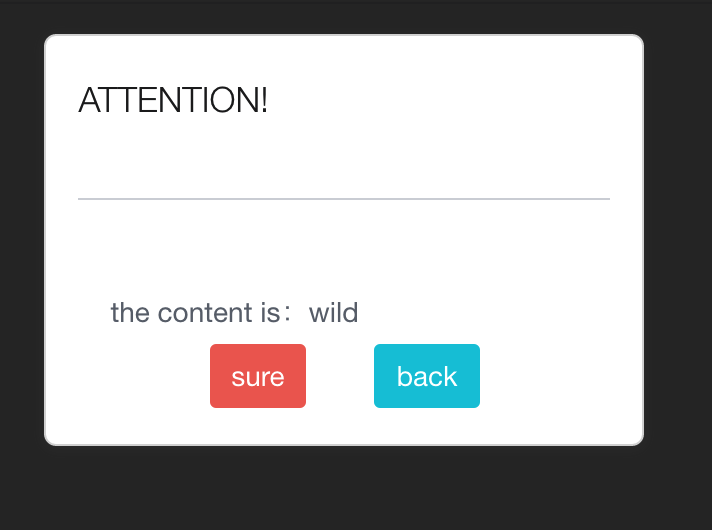

# vue-ui

vue-ui includes these components: 
- vue-pagination
- vue-message
- vue-confirm
- vue-datepicker
- vue-chart
- vue-upload

# usage

you can scan these ui components upon up steps.
- git clone https://github.com/raganyaYoung/vue-ui.git
- cd vue-ui
- npm install
- npm start 
- localhost:4040

# examples

## vue-pagination
![vue pagination] (https://raw.githubusercontent.com/raganyaYoung/vue-pagination/master/screenshots/1.jpg) 

#### Installation
vue-pagination for using required vuejs and bulma 

[Vue.js](http://vuejs.org)

[bulma](http://bulma.io)

#### Options
| Name          | Type     | Default | Required | Description     |
| ------------- |:--------:| -------:| --------:| ---------------:|
| current_page  | INTEGER  | 1       | true     | current page    |
| total_pages   | INTEGER  |         | true     | total pages     |
| count         | INTEGER  |         | true     | the count of your  |

## vue-chart

A simple chart component for vue

#### Installation
vue-chart for using required vuejs and Chart.js 

[Vue.js](http://vuejs.org)

[Chart.js](http://www.chartjs.org/docs/)


####  Example
#### line&bar&pie&doughnut chart

![vue line chart] (https://raw.githubusercontent.com/raganyaYoung/vue-chart/master/demo/line.png) 
***
![vue bar chart] (https://github.com/raganyaYoung/vue-chart/blob/master/demo/bar.png?raw=true) 
***
![vue pie chart] (https://raw.githubusercontent.com/raganyaYoung/vue-chart/master/demo/pie.png) 
***
![vue doughnut chart] (https://raw.githubusercontent.com/raganyaYoung/vue-chart/master/demo/doughnut.png) 

#####  usage
```
  <v-chart type=“line" // or bar/pie/doughnut 
		width=“300"
		height=“300"
		:chartdata=“chartdata"
		:labels=“chartlabels"
		:responsive=“false"
		label="line chart”>
	</v-chart>
```
##### props
| Name          | Type     | Default | Required | Description     |
| ------------- |:--------:| -------:| --------:| ------------:|
| type  | BOOLEAN  |doughnut | true     | type of chart    |
| width   | INTEGER  | 400   | false     | width of chart     |
| height | INTEGER  | 300    | false     | height of chart  | 
| chartdata | ARRAY  | [12, 19, 3]    |true     | data of chart  |
| labels | ARRAY  | ['d1', 'd2', 'd3']     | true     | name of every data note  |
| responsive | BOOLEAN  | false    | true     | resize your chart (false means can resize )  |
| label | TEXT  | 'My Chart'    | false     | name of chart  |
 
 ***
#### radar chart
![vue radar chart] (https://raw.githubusercontent.com/raganyaYoung/vue-chart/master/demo/radar.png)

#####  usage
```
    <v-chart type="radar"
		width="300"
		height="300"
		:radardata="radarData"
		:labels="chartLabels"
		:responsive="false"
		:radarlabel="radarLabel">
	</v-chart>
```
##### props
| Name          | Type     | Default | Required | Description     |
| ------------- |:--------:| -------:| --------:| ------------:|
| type  | BOOLEAN  |doughnut | true     | type of chart    |
| width   | INTEGER  | 400   | false     | width of chart     |
| height | INTEGER  | 300    | false     | height of chart  | 
| radardata | ARRAY  | [ [1,2,3], [4,5,6] ]    |true     | data of radar chart  |
| labels | ARRAY  | ['d1', 'd2', 'd3']    | true     | name of every data note  |
| responsive | BOOLEAN  | false    | true     | resize your chart (false means can resize )  |
| label | TEXT  | 'My Chart'    | false     | name of chart  |

## vue-message

this component belongs to global 

![vue-message] (src/components/examples/2.jpg) 

#####  usage
```
  this.message(2, 'message', true)
  
```
##### props
| Name          | Type     | Default | Required | Description     |
| ------------- |:--------:| -------:| --------:| ------------:|
| visible  | BOOLEAN  |true | true     | visibility of message    |
| message   | text  | ''   | true     | content of message     |
| duration | INTEGER  | 2    | true     | duration of showing message  | 

## vue-confirm



#### usage

```
<confirm
  :visible.sync="confirm_show" //true of false
  :msg="confirm_msg"
  :on_confirm="_confirm"
  :on_cancel="_cancel">
</confirm>
```

## vue-datepicker


this componnets is according to others datepicker and improve it.

#### usage

```
<template>
  <div>
    <datepicker format="YYYY-MM-DD" :value.sync="startAt"></datepicker>
    - <datepicker format="YYYY-MM-DD" :value.sync="endAt"></datepicker>
  </div>
</template>
<script>
  import Vue from 'vue'
  import datepicker from '../common/datepicker.vue'
  export default ({
    data() {
      return {
        startAt: '',
        endAt: ''
      }
    },
    components: {
      datepicker
    },
    watch: {
      'endAt': function() {
        let startAt = new Date(this.startAt.replace(/\-/g, "\/"))
        let endAt = new Date(this.endAt.replace(/\-/g, "\/"))
        if(this.startAt !== '' && this.endAt !== '' && startAt >= endAt) {
          Vue.set(this, 'endAt', this.startAt)
        }
      },
      'startAt': function() {
        let startAt = new Date(this.startAt.replace(/\-/g, "\/"))
        let endAt = new Date(this.endAt.replace(/\-/g, "\/"))
        if(this.startAt !== '' && this.endAt !== '' && endAt <= startAt) {
          Vue.set(this, 'startAt', this.endAt)
        }
      },
    }
  })
</script>
```


